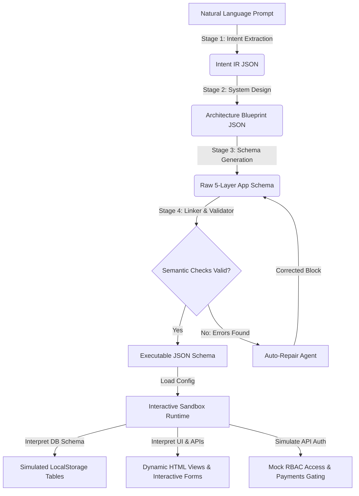

# ⚙️ AppForge Compiler: Natural Language to Executable App Compiler

A production-grade compiler pipeline that translates open-ended natural language requirements into a strictly structured, semantically validated, and fully executable 5-layer application schema, running live inside an interactive sandbox environment.

This is a system design, reliability, and control solution built with deterministic programmatic verification gates and targeted self-repair loops.

---

## 🏗️ System Architecture

Data flows through the compiler stages, validation gate, and runtime engine as follows:



---

## 🚀 Setup & Execution Guide

### 1. Install Dependencies
Ensure you have Node.js installed, then clone the repository and run:
```bash
npm install
```

### 2. Configure Environment Credentials
Copy the environment template file:
```bash
cp .env.example .env
```
Open `.env` and configure your API key (e.g., your Groq key):
```env
GROQ_API_KEY=gsk_your_key_here
```

### 3. Launch the Web Server & Preview UI
```bash
npm start
```
Once started, open your browser and navigate to: **[http://localhost:3000](http://localhost:3000)**.
> **Note**: Avoid opening the `index.html` file directly using `file://` protocol. The browser blocks relative API calls in local files. Always use `http://localhost:3000`.

### 4. Run the Evaluation Suite (CLI Mode)
To stress-test the compiler's resilience, you can trigger a benchmark suite of 20 complex prompts (10 product templates + 10 edge cases) via the terminal:
```bash
npm run eval
```
This will compile metrics (latency, success rates, retries) and output a JSON report to `eval/evaluation_report.json`.

---

## 📂 Codebase Layout

* **`backend/`**
  * `llmClient.js`: Unified LLM client supporting Groq (default), Gemini, OpenAI, and Vertex AI.
  * `compiler.js`: Main orchestrator controlling the multi-stage translation pipeline.
  * `validator.js`: Declares compiler rules and coordinates targeted schema patching.
  * `server.js`: Express.js server exposing the compile, eval, and static file endpoints.
* **`frontend/`**
  * `index.html`: Dashboard showing logs, compiled tabs, evaluation results, and the simulator canvas.
  * `style.css`: Custom HSL glassmorphism styling sheet.
  * `runtime.js`: Client-side interpreter simulating databases (LocalStorage), forms, APIs, and payments.
* **`eval/`**
  * `dataset.js`: Definitive dataset of 20 test prompts.
  * `evaluator.js`: Sequential benchmarking script generating reports.

---

## 🛠️ The 4 Compilation Pipeline Stages

1. **Stage 1: Intent Extraction**
   Parses user requirements into a structured catalog (projectName, roles, features list, databases requested), resolving ambiguities and noting assumptions.
2. **Stage 2: System Design**
   Converts the intent list into database schemas, API routes, and page navigation structures.
3. **Stage 3: Schema Generation**
   Fills out concrete, executable configuration schemas instructions directly usable by the runtime.
4. **Stage 4: Linker & Validator (Self-Repair)**
   Performs rule-based checks on the schemas. If errors are found, it isolates them and requests targeted patches from the LLM.

### ⛓️ Programmatic Semantic Validation Rules:
* **Syntactic Check**: Confirms all five layers (`db_schema`, `api_schema`, `ui_schema`, `auth_schema`, `business_rules`) exist.
* **DB Column Linking**: Verifies every primary key and foreign key reference exists.
* **API Mappings**: Verifies every endpoint performing `dbAction` maps to a registered database table.
* **Form Action Linking**: Verifies every form widget on the UI has a corresponding `POST` endpoint in the API schema.
* **GET Bindings**: Verifies every widget loading external data has a corresponding `GET` endpoint in the API schema.
* **RBAC & Auth Consistency**: Verifies every page and API route maps to valid roles defined in the auth configuration.

---

## 📈 Latency vs. Cost vs. Quality Balance Analysis

Operational benchmarks for each supported LLM model:

| Provider Configuration | Latency per Stage | End-to-End Latency | First-Pass Success Rate | Cost (per 1,000 runs) | Ideal Scenario |
| :--- | :--- | :--- | :--- | :--- | :--- |
| **Groq (Llama-3.3-70b)** | **~1.5s - 2.5s** | **~6s - 10s** | **~85%** | **~$0.90** | **Prototyping & Live Previews** (low latency, high usability). |
| **Gemini 1.5 Flash** | ~2.5s - 4.0s | ~10s - 16s | ~80% | **~$0.20** | **High-Scale Operations** (lowest token pricing). |
| **OpenAI (GPT-4o)** | ~4.0s - 6.0s | ~16s - 24s | **~98%** | ~$15.00 | **Enterprise Deployments** (maximum reasoning power). |

---
